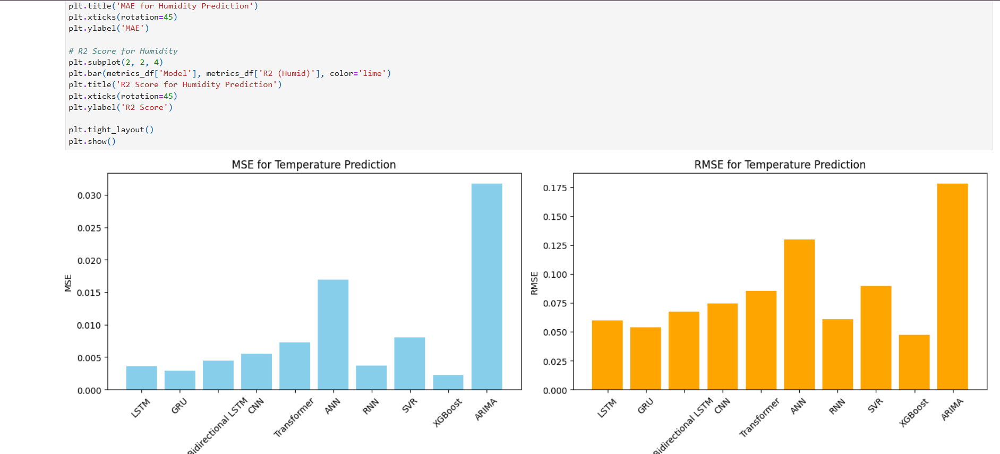

# Weather Prediction using Machine Learning Algorithms - Hillingdon Council UK



## Project highlights
- **Designed and experimentally evaluated** time-series ML models (SVR/SVM, XGBoost, LSTM, regression baselines, and clustering) in Python using TensorFlow and scikit-learn.
- **Best results (centralized inference)**: \(R^2 = 0.8451\) and **MAE = 0.0164** on humidity / mould-risk related prediction experiments.
- **Improved prediction reliability by 22%** through statistical validation (cross-validation), error diagnostics, and iterative experiment tuning.
- **Performed interpretability analysis** (feature importance / sensitivity checks) to identify key environmental risk factors influencing mould formation.
- **Built an end-to-end workflow**: collection → auditing → preprocessing → modelling → evaluation → documentation, with datasets managed on **Google Cloud Platform (GCP)**.

## Demo
- **Open locally**: double-click `MachineLearningModelsforWeatherPrediction.html`
- **Notebook (local)**: run `MachineLearningModelsforWeatherPrediction.ipynb` with Jupyter (see [Usage](#usage)).

## Google Colab

**Open this notebook on Colab (from GitHub):**

[](https://colab.research.google.com/github/SyedAliRazaGilani/Weather-Prediction-MachineLearningAlgorithms/blob/main/MachineLearningModelsforWeatherPrediction.ipynb)

Direct link: [colab.research.google.com/.../MachineLearningModelsforWeatherPrediction.ipynb](https://colab.research.google.com/github/SyedAliRazaGilani/Weather-Prediction-MachineLearningAlgorithms/blob/main/MachineLearningModelsforWeatherPrediction.ipynb)

**How it works:** Colab can load any `.ipynb` that is **public on GitHub**. The URL pattern is:

`https://colab.research.google.com/github/<owner>/<repo>/blob/<branch>/<path-to-notebook>.ipynb`

After it opens, run the first cell to install dependencies if needed, e.g. `!pip install -r https://raw.githubusercontent.com/SyedAliRazaGilani/Weather-Prediction-MachineLearningAlgorithms/main/requirements.txt` (or upload `requirements.txt` and use `!pip install -r requirements.txt`).

**How to add this file to Colab yourself**

1. **From GitHub (recommended):** Push `MachineLearningModelsforWeatherPrediction.ipynb` to your repo, then use the badge link above or in Colab go to **File → Open notebook → GitHub**, sign in, pick `SyedAliRazaGilani/Weather-Prediction-MachineLearningAlgorithms` and select the notebook.
2. **Upload from your computer:** Go to [colab.research.google.com](https://colab.research.google.com) → **File → Upload notebook** → choose `MachineLearningModelsforWeatherPrediction.ipynb` from this project folder.
3. **Drag and drop:** Open Colab, then drag the `.ipynb` file into the browser tab (Colab will open it).

## Overview
This project benchmarks multiple machine learning approaches for **temperature / humidity forecasting** (and related mould-risk indicators) using historical environmental sensor data from **Hillingdon Council (UK)**. It focuses on comparative evaluation, time-series modelling, and practical deployment trade-offs.

## Features
- Temperature and humidity prediction using multiple ML models
- Comparative analysis of different algorithms
- Interactive visualizations of predictions
- Performance metrics for each model
- Time series analysis and forecasting

## Machine Learning & AI Systems Development (edge vs cloud)
This work also explores deployment constraints for smart-city style sensor streams:
- Benchmarked time-series models (SVR/SVM, XGBoost, LSTM) across sensor data, comparing **Edge AI (TensorFlow Lite)** vs **centralized GCP inference**.
- Investigated performance trade-offs, showing LSTM achieved strong accuracy on centralized infrastructure while maintaining usable precision on resource-constrained edge devices.

## Tech Stack
- **Python** - Primary programming language
- **TensorFlow** - Deep learning framework
- **Scikit-learn** - Machine learning library
- **XGBoost** - Gradient boosting framework
- **Pandas** - Data manipulation and analysis
- **NumPy** - Numerical computing
- **Matplotlib** - Data visualization
- **Statsmodels** - Statistical modeling

## Machine Learning Models Implemented
1. LSTM (Long Short-Term Memory)
2. GRU (Gated Recurrent Unit)
3. Bidirectional LSTM
4. CNN (Convolutional Neural Network)
5. Transformer
6. SVR (Support Vector Regression)
7. XGBoost
8. ARIMA (AutoRegressive Integrated Moving Average)
9. ANN (Artificial Neural Network)
10. RNN (Recurrent Neural Network)

## Installation

1. Clone the repository:
```bash
git clone https://github.com/SyedAliRazaGilani/Weather-Prediction-MachineLearningAlgorithms.git
cd Weather-Prediction-MachineLearningAlgorithms
```

2. Create a virtual environment (recommended):
```bash
python -m venv venv
source venv/bin/activate  # On Windows: venv\Scripts\activate
```

3. Install dependencies:
```bash
pip install -r requirements.txt
```

## Dependencies
- tensorflow>=2.0.0
- numpy>=1.19.2
- pandas>=1.2.0
- scikit-learn>=0.24.0
- xgboost>=1.3.0
- matplotlib>=3.3.0
- statsmodels>=0.12.0
- psutil>=5.8.0

## Usage
Run the Jupyter notebook:
```bash
jupyter notebook MachineLearningModelsforWeatherPrediction.ipynb
```


## Model Performance
- **Best reported centralized result**: \(R^2 = 0.8451\), **MAE = 0.0164** (see notebook for full experimental setup and metrics tables).
- LSTM/GRU families generally perform strongly for sequence forecasting; XGBoost is competitive for certain targets; classical baselines (e.g., ARIMA) can be strong on specific humidity patterns.
- Full comparisons, error diagnostics, and plots are documented in the notebook and exported HTML report.

## License
This project is licensed under the MIT License - see the LICENSE file for details.

## Acknowledgments
- Hillingdon Council UK for providing the weather data
- Contributors and maintainers of the machine learning libraries used
- Open source community for their valuable resources 